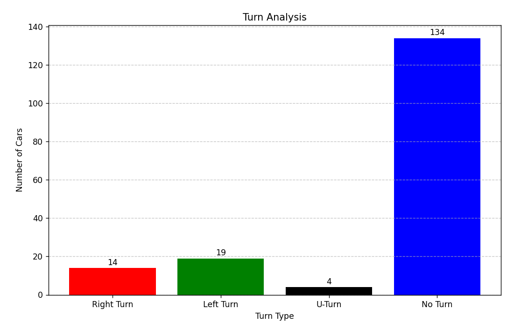

# Car Turn Detection and Tracking System


This project implements a car tracking system that uses **YOLOv8** for object detection and **DeepSort** for multi-object tracking to identify and count cars making specific turns (right, left, U-turn) in a video. A Flask-based web application is included to modify predefined zones if needed. The system outputs an annotated video with bounding boxes and a detailed turn analysis.

## Objective

The primary goal is to:
- Track all cars in a video and detect their turns:
  - **Right Turn**: Red bounding box
  - **Left Turn**: Green bounding box
  - **U-Turn**: Black bounding box
  - **No Turn Detected Yet**: Blue bounding box
- Assign unique IDs to each car.
- Provide a final analysis with the total number of cars and a breakdown of turn counts.

## Features

1. **Car Detection and Tracking**:
   - Utilizes **YOLOv8** (`car_detection.pt`) for real-time car detection.
   - Employs **DeepSort** for robust multi-object tracking with tuned parameters.
   - Applies **Non-Maximum Suppression (NMS)** to eliminate duplicate detections.
2. **Turn Detection**:
   - Uses eight predefined zones (`north_in`, `north_out`, `south_in`, `south_out`, `east_in`, `east_out`, `west_in`, `west_out`) in `zones.json`.
   - Tracks car entry and exit zones to classify turns using a ray-casting algorithm.
3. **Web-based Zone Annotation**:
   - Flask app allows users to upload a video and modify zones if needed, displaying the first frame on a canvas for polygon drawing.
   - Supports scaling for large frames (max width 1000px) and saves zones in original resolution.
4. **Output**:
   - Generates `output_video.mp4` with annotated bounding boxes and car IDs.
   - Provides a detailed console analysis of car counts and turns, plus a bar chart visualization (`turn_analysis.png`).



## Dataset and Model Training

- **Dataset**: The car detection model was fine-tuned using a dataset I annotated on Roboflow:
  - Link: [Car Detection Dataset on Roboflow](https://universe.roboflow.com/drs-sxt7b/car-detection-dg0ie/dataset/3)
  - Contains images with labeled cars, annotated by me to ensure relevance to this task.
- **Source Video for Annotation**: The video used for zone annotation and testing was sourced from YouTube:
  - Link: [Intersection Traffic Video](https://www.youtube.com/watch?v=R_5c6R60Q-E)
  - This video features a multi-lane intersection, ideal for capturing various car turns.
- **Model Training**: The YOLOv8 model (`car_detection.pt`) was trained using the `yolov8n_train.ipynb` IPython notebook (included in the repository).
  - **Why YOLOv8**: Chosen for its balance of speed and accuracy, making it suitable for real-time detection.
  - Training details are documented in the notebook, including data preprocessing, hyperparameter tuning, and evaluation metrics.

## Prerequisites

- **Python**: 3.8 or higher
- **Libraries**:
  - `ultralytics` (for YOLOv8)
  - `opencv-python` (video processing)
  - `numpy` (numerical operations)
  - `deep_sort_realtime` (tracking)
  - `flask` (web app)
  - `matplotlib` (visualization)
  - `tqdm` (progress bar)
- **Pre-trained Model**: `car_detection.pt` (fine-tuned YOLOv8 model, included or downloadable from training output).

## Installation

1. **Clone the Repository**:
   ```bash
   git clone <repository-url>
   cd car-turn-detection
   ```
2. **Install Dependencies**:
   ```bash
   pip install -r requirements.txt
   ```
3. **Model Setup**:
   - Ensure `car_detection.pt` is in the project root or update the path in `car_tracking.py`.
   - If not provided, train the model using `yolov8n_train.ipynb` with the Roboflow dataset.

## Usage

### 1. Car Tracking
- **Prepare Files**:
  - Place `input.mp4` and `zones.json` (with predefined zones) in the project root. The `zones.json` file already contains default zones (`north_in`, `north_out`, etc.), tailored to the sample video.
  - Ensure `car_detection.pt` is available.
- **Run the Tracking Script**:
  ```bash
  python car_tracking.py
  ```
- **Output**:
  - `output_video.mp4`: Video with bounding boxes and IDs.
  - Console output: Final analysis of car counts and turns.
  - `turn_analysis.png`: Bar chart summarizing turn counts.

### 2. Zone Annotation (Optional)
- Zones are predefined in `zones.json`, but if you want to change a zone (e.g., `north_in`, `north_out`):
  - **Run the Flask App**:
    ```bash
    python flask_app.py
    ```
  - Open `http://127.0.0.1:5000/` in a browser.
  - Upload `input.mp4` and select the zone you want to modify (e.g., `north_in`).
  - After submitting, the first frame will be displayed on a canvas. Draw a new 4-point polygon for the selected zone and save it.
  - The updated zone will overwrite the corresponding entry in `zones.json` in the original video resolution.

## Key Components and Decisions

### 1. YOLOv8
- **Why**: Selected for its state-of-the-art performance in object detection, offering high speed and accuracy. Fine-tuned on the Roboflow dataset to optimize for car detection in traffic scenarios.
- **Configuration**: Confidence threshold of 0.5 ensures a balance between precision and recall.

### 2. DeepSort
- **Why**: Combines motion and appearance features for reliable tracking, reducing ID switches in crowded scenes like intersections.
- **Tuning**:
  - `max_age=50`: Persists tracks during brief occlusions (e.g., cars behind others).
  - `nn_budget=200`: Enhances appearance feature memory for robust re-identification.
  - `n_init=2`: Quickly confirms tracks to minimize false positives.
  - `max_iou_distance=0.7`, `max_cosine_distance=0.4`: Balances motion and appearance for association.

### 3. NMS (Non-Maximum Suppression)
- **Why**: Prevents duplicate detections from YOLOv8, ensuring each car has one bounding box.
- **Configuration**: IoU threshold of 0.5 effectively removes overlaps while retaining valid detections.

### 4. Zone-based Turn Detection
- **Why**: Predefined polygon zones allow flexible and accurate classification of entry/exit points for turn detection.
- **Implementation**: Uses ray-casting (`point_in_polygon`) to determine if a car’s center is inside a zone, providing a computationally efficient solution.

### 5. Flask App
- **Why**: Offers an intuitive interface to modify zones if needed, eliminating manual JSON editing and reducing errors.
- **Scaling**: Resizes large frames (max width 1000px) for display while preserving original coordinates in `zones.json`.

## Running the Demo

1. **Prepare Files**:
   - Download `input.mp4` from [YouTube](https://www.youtube.com/watch?v=R_5c6R60Q-E) or use your own video.
   - Use `car_detection.pt` (trained via `yolov8n_train.ipynb` or provided).
2. **Run Tracking**:
   - Use the default `zones.json` and run `car_tracking.py` to generate `output_video.mp4` and analysis.
3. **Modify Zones (Optional)**:
   - Run `flask_app.py` to update zones if necessary, then rerun `car_tracking.py`.

## Video Demo

- **Demo Explanation**: A short video explaining the code and task:
  - Link: [Demo Video on Google Drive](https://drive.google.com/file/d/1hA0ec2Wk8ztq0NKvqZHXvX0c7JzIz-wP/view?usp=sharing)
- **Output Video**: Sample output with annotated bounding boxes:
  - Link: [Output Video on Google Drive](https://drive.google.com/file/d/1uWqUAcbwaK-E22FqJAMa6TalX3zm8esn/view)

The demo video covers:
- Flask app usage for zone modification.
- Real-time car tracking with color-coded bounding boxes.
- Final analysis output and visualization.
