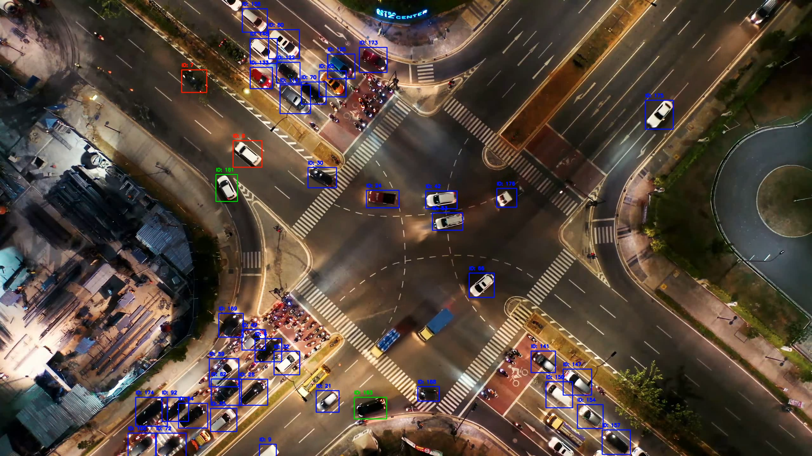

# Car Turn Detection and Tracking System

This project implements a car tracking system using YOLOv8 for object detection and DeepSort for multi-object tracking to identify and count cars making specific turns (right, left, U-turn) in a video. It also includes a Flask-based web application for annotating zones in the video, which are used to determine car movements.

## Objective
The goal is to:
- Track all cars in a video and detect their turns (right, left, U-turn).
- Visualize cars with bounding boxes:
  - **Blue**: No turn detected yet.
  - **Red**: Right turn detected at least once.
  - **Green**: Left turn detected at least once.
  - **Black**: U-turn detected at least once.
- Assign unique IDs to each car.
- Provide a final analysis with the total number of cars and turn counts.

## Features
1. **Car Detection and Tracking**:
   - Uses YOLOv8 (`car_detection.pt`) for real-time car detection.
   - Employs DeepSort for robust multi-object tracking with tuned parameters.
   - Applies Non-Maximum Suppression (NMS) to eliminate duplicate detections.
2. **Turn Detection**:
   - Defines eight zones (north_in, north_out, south_in, south_out, east_in, east_out, west_in, west_out) in `zones.json`.
   - Tracks car entry and exit zones to classify turns.
3. **Web-based Zone Annotation**:
   - Flask app to upload a video and annotate zones on the first frame.
   - Handles scaling for large frames and saves zones in original resolution.
4. **Output**:
   - Generates an output video (`output_video.mp4`) with annotated bounding boxes.
   - Prints a detailed analysis of car counts and turns.

## Prerequisites
- Python 3.8+
- Libraries:
  - `ultralytics` (for YOLOv8)
  - `opencv-python`
  - `numpy`
  - `deep_sort_realtime`
  - `flask`
- A pre-trained YOLOv8 model (`car_detection.pt`) trained on car detection.

## Installation
1. Clone the repository:
   ```bash
   git clone <repository-url>
   cd car-turn-detection
   ```
2. Install dependencies:
   ```bash
   pip install -r requirements.txt
   ```
3. Ensure `car_detection.pt` is in the project root or update the path in `car_tracking.py`.

## Usage
### 1. Zone Annotation
- Run the Flask app:
  ```bash
  python flask_app.py
  ```
- Open `http://127.0.0.1:5000/` in a browser.
- Upload a video (`input.mp4`) and select a zone to annotate.
- Draw a 4-point polygon for each zone (e.g., `north_in`, `north_out`) and save. Repeat for all eight zones.
- Zones are saved in `zones.json`.

### 2. Car Tracking
- Ensure `input.mp4` and `zones.json` (with all eight zones) are in the project root.
- Run the tracking script:
  ```bash
  python car_tracking.py
  ```
- Output:
  - `output_video.mp4`: Video with bounding boxes and IDs.
  - Console output: Final analysis of car counts and turns.


## Key Components and Decisions
### 1. YOLOv8
- **Why**: Chosen for its state-of-the-art speed and accuracy in object detection. Pre-trained on a car detection dataset (`car_detection.pt`) to ensure robust car identification.
- **Configuration**: Confidence threshold set to 0.5 to balance precision and recall.

### 2. DeepSort
- **Why**: Extends SORT with appearance descriptors, reducing identity switches in crowded scenes. Ideal for tracking cars across frames.
- **Tuning**: 
  - `max_age=50`: Allows tracks to persist longer during occlusions.
  - `nn_budget=200`: Increases memory for appearance features.
  - `n_init=2`: Confirms tracks quickly to reduce false positives.
  - `max_iou_distance=0.7`, `max_cosine_distance=0.4`: Balances motion and appearance for association.

### 3. NMS
- **Why**: YOLOv8 may produce duplicate detections; NMS with `iou_threshold=0.3` ensures only the best bounding box per car is tracked.

### 4. Zone-based Turn Detection
- **Why**: Polygon-based zones provide a flexible way to define entry/exit points, enabling turn classification based on car trajectories.
- **Implementation**: Uses ray-casting (`point_in_polygon`) to check if a car's center is inside a zone.

### 5. Flask App
- **Why**: Simplifies zone annotation with a user-friendly interface, ensuring accurate zone definitions without manual JSON editing.
- **Scaling**: Handles large videos by resizing frames (max width 1000px) while preserving original coordinates.

## Running the Demo
1. Prepare `input.mp4` and `car_detection.pt`.
2. Annotate zones using the Flask app.
3. Run `car_tracking.py` to process the video and generate output.

## Video Demo
A short demo video (`demo.mp4`) with code explanation is available in the repository. It covers:
- Flask app usage for zone annotation.
- Real-time car tracking with bounding boxes.
- Final analysis output.
---
